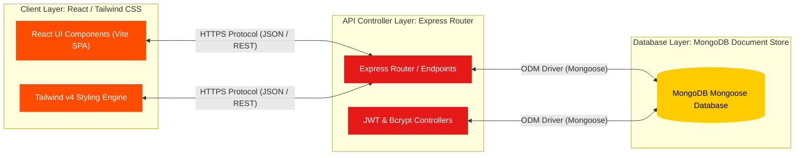
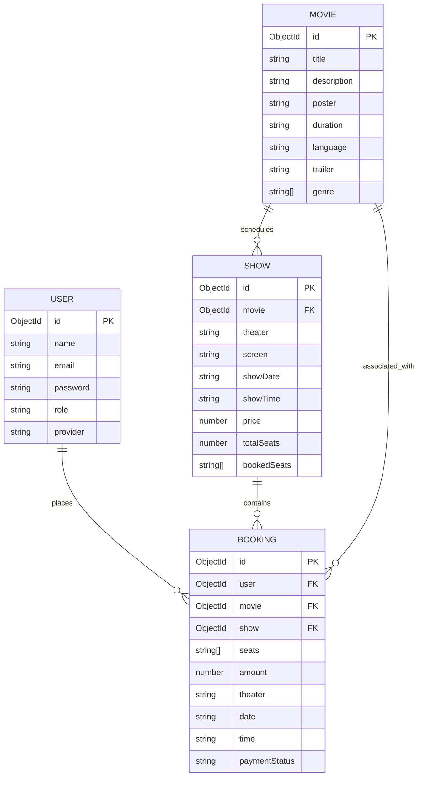

# PROJECT REPORT

## BOOKMYTICKETS: A HIGH-FIDELITY CINEMATIC TICKET BOOKING PLATFORM
### A Capstone Project Report submitted in partial fulfillment of the requirements for the Degree of Bachelor of Technology / Science in Computer Science & Engineering

---

## TABLE OF CONTENTS
1. [Abstract](#abstract)
2. [Chapter 1: Introduction & Project Overview](#chapter-1-introduction--project-overview)
   - 1.1 Project Objective
   - 1.2 Problem Statement
   - 1.3 System Scope
3. [Chapter 2: System Architecture & Tech Stack](#chapter-2-system-architecture--tech-stack)
   - 2.1 Architectural Overview
   - 2.2 Frontend Architecture
   - 2.3 Backend Architecture
   - 2.4 Component-Level Workflow
4. [Chapter 3: Database & Schema Design](#chapter-3-database--schema-design)
   - 3.1 Entity Relationship & Schema Model
   - 3.2 User Schema (`user.js`)
   - 3.3 Movie Schema (`movieModel.js`)
   - 3.4 Show Schema (`showModel.js`)
   - 3.5 Booking Schema (`bookingModel.js`)
5. [Chapter 4: Core Implementation & Key Features](#chapter-4-core-implementation--key-features)
   - 4.1 Hybrid Authentication System
   - 4.2 Interactive Seat Grid & Recliner Engine
   - 4.3 Secure Gateway Payment Gateway Integration
   - 4.4 Automated OMDB API Synchronizer
   - 4.5 Digital Receipt Generation (jsPDF)
   - 4.6 Dual-Role Administrative Panel
6. [Chapter 5: API Endpoints & Route Reference](#chapter-5-api-endpoints--route-reference)
7. [Chapter 6: System Flow & Sequential Workflows](#chapter-6-system-flow--sequential-workflows)
8. [Chapter 7: Design Theme & Microsoft Word (DOCX) Formatting Guide](#chapter-7-design-theme--microsoft-word-docx-formatting-guide)
   - 7.1 Visual Palette (Cyberpunk Cinematic Palette)
   - 7.2 Page Layout & Margin Setup
   - 7.3 Typography Styles (Fonts & Sizing)
   - 7.4 Document Style Classes (Heading mapping)
   - 7.5 Interactive Callouts, Tables & Spacing
9. [Conclusion & Future Scope](#conclusion--future-scope)

---

## ABSTRACT

**BookMyTickets** is a state-of-the-art, high-fidelity online movie ticket booking platform designed using the MERN (MongoDB, Express.js, React, Node.js) stack. The application aims to solve critical real-world challenges in contemporary movie ticketing systems—such as cluttered interfaces, inefficient seat grid layouts, delayed transaction verification, and lack of offline ticket preservation. 

By integrating modern authentication models (Local Credentials, Google OAuth via Firebase, and Clerk SDK wrappers), the platform offers a seamless login experience. The user experience is elevated through a rich, cyberpunk-inspired dark aesthetic, optimized reactive grids, and real-time interactive seat layouts supporting standard and premium recliner tiers. The system features a double-verification payment model powered by Razorpay API and cryptographically validated backend signatures, preventing double-bookings. Finally, users can download physical digital receipts generated client-side via `jsPDF`. The system is accompanied by a modular Administrative Dashboard giving theater managers granular CRUD controls over movies, active shows, and customer bookings.

---

## CHAPTER 1: INTRODUCTION & PROJECT OVERVIEW

### 1.1 Project Objective
The principal objective of **BookMyTickets** is to build a high-performance, secure, and visually premium online movie ticketing system that bridges the gap between cinematic immersion and transactional ease. 
Specifically, the system aims to:
- Deliver a fast, responsive, single-page application (SPA) user interface.
- Provide a clear, color-coded, interactive seat mapping grid where users can select standard seats (Rows A–J) or premium recliner seats (Row R) with automated subtotal calculation.
- Eliminate transaction discrepancies through an end-to-end cryptographic payment signature validation workflow.
- Equip theater administrators with a secure console to add blockbusters, configure screen layouts, manage timings, and track revenues.

### 1.2 Problem Statement
Traditional cinema booking portals suffer from:
1. **Inefficient Navigation**: Clunky multi-page reloads and text-heavy list views create friction during checkout.
2. **Vague Seat Selections**: User interfaces that fail to distinguish seat grades (standard vs. luxury recliners), leading to customer dissatisfaction.
3. **Double Booking Anomalies**: High concurrent traffic often causes two users to purchase the exact same seat simultaneously.
4. **Complex Auth Portals**: Restricting users to email-only registrations reduces user engagement.
5. **No On-Demand Proof-of-Purchase**: Forcing reliance on email-only receipts without letting users download instant offline PDFs.

### 1.3 System Scope
The scope of **BookMyTickets** covers:
- **Client Application**: Responsive landing page, detailed movie descriptions, dynamic trailers, interactive scheduling, seat layouts, profile management, favorites lists, and booking histories.
- **Server Application**: RESTful API endpoints handling secure user profiles, session cookies, database CRUD queries, and third-party API hookups.
- **Database Engine**: NoSQL document storage representing structured relations between users, movies, active shows, and payment statuses.
- **Payment Verification Engine**: Creating unique payment orders and validating hashes in the backend using standard HMAC SHA-256 algorithms.

---

## CHAPTER 2: SYSTEM ARCHITECTURE & TECH STACK

### 2.1 Architectural Overview
The system relies on a classic **3-Tier Client-Server-Database Architecture** to separate concerns and ensure optimal system horizontal scalability.

### Architectural Layout Diagram



#### High-Fidelity Architectural Design Layout
For a premium visual representation in your printed or exported report, see the generated diagram design layout:


### 2.2 Frontend Architecture
Developed as a React Single-Page Application (SPA) compiled through Vite. It incorporates:
*   **Vite**: Next-generation frontend tooling providing extremely fast Hot Module Replacement (HMR) and optimized rollup production bundles.
*   **React Router DOM (v7)**: Handles client-side routing, protected user dashboards, and dynamic admin layouts.
*   **Tailwind CSS (v4)**: Used for responsive styles, custom glow grids, glassmorphism overlays, and premium cyber-coral themes.
*   **Firebase Client SDK**: Integrated for Google Federated Authentication.
*   **Clerk Client React**: High-level react wrappers to manage complex secure user sessions.
*   **Axios**: Custom-configured HTTP client managing API routes, JSON requests, and with-credentials cookie verification.
*   **jsPDF**: Client-side document canvas drawing library which generates elegant PDF tickets on demand.

### 2.3 Backend Architecture
Built with Node.js and Express.js, implementing an organized MVC pattern:
*   **Express.js**: Lightweight framework managing request pipelines, static file streaming (movie posters uploads), error middleware, and API routing.
*   **JSON Web Tokens (JWT) & BcryptJS**: Encrypts user credentials at rest and yields secure, stateful HTTP-only cookie-stored tokens.
*   **Multer**: Custom multipart form-data middleware for processing administrative movie poster and banner uploads to local directory `/uploads`.
*   **Crypto & Svix**: Used for internal hashing, cryptographic order validation, and webhook signature verification.
*   **Razorpay SDK**: Handles backend Order IDs creation and syncs with the frontend client.

---

## CHAPTER 3: DATABASE & SCHEMA DESIGN

### 3.1 Entity Relationship & Schema Model
The system uses MongoDB to model flexible, referenced data structures. The relationships are established via Mongoose `ObjectId` references.



---

### 3.2 User Schema (`user.js`)
Manages both customer accounts and administrators, keeping authentication flexible via a `provider` flag and hierarchical roles.
```javascript
const userSchema = new mongoose.Schema(
  {
    name: {
      type: String,
      required: true,
    },
    email: {
      type: String,
      required: true,
      unique: true,
    },
    password: {
      type: String,
      default: "",
    },
    avatar: {
      type: String,
      default: "",
    },
    provider: {
      type: String,
      enum: ["local", "google"],
      default: "local",
    },
    role: {
      type: String,
      enum: ["user", "owner", "admin"],
      default: "user",
    },
  },
  { timestamps: true }
);
```

---

### 3.3 Movie Schema (`movieModel.js`)
Stores granular movie details, supporting both local dashboard uploads and dynamic sync feeds from OMDB.
```javascript
const movieSchema = new mongoose.Schema(
  {
    title: String,
    description: String,
    poster: String,
    banner: String,
    genre: [String],
    duration: String,
    language: String,
    releaseDate: Date,
    trailer: String,
    cast: [String],
  },
  { timestamps: true }
);
```

---

### 3.4 Show Schema (`showModel.js`)
Maps scheduled screenings. It references the `Movie` model and maintains an array of `bookedSeats` string keys (e.g., `["A1", "A2", "R5"]`) to evaluate grids in real-time.
```javascript
const showSchema = new mongoose.Schema(
  {
    movie: {
      type: mongoose.Schema.Types.ObjectId,
      ref: "Movie",
    },
    theater: String,
    screen: String,
    showDate: String,
    showTime: String,
    price: Number,
    totalSeats: Number,
    bookedSeats: {
      type: [String],
      default: [],
    },
  },
  { timestamps: true }
);
```

---

### 3.5 Booking Schema (`bookingModel.js`)
Represents successfully finalized bookings, linking users, movies, and shows with total pricing breakdown, seats, and gateway transaction statuses.
```javascript
const bookingSchema = new mongoose.Schema(
  {
    user: {
      type: mongoose.Schema.Types.ObjectId,
      ref: "User",
    },
    movie: {
      type: mongoose.Schema.Types.ObjectId,
      ref: "Movie",
    },
    show: {
      type: mongoose.Schema.Types.ObjectId,
      ref: "Show",
      default: null
    },
    seats: [String],
    amount: Number,
    theater: String,
    date: String,
    time: String,
    paymentStatus: {
      type: String,
      default: "paid",
    },
  },
  { timestamps: true }
);
```

---

## CHAPTER 4: CORE IMPLEMENTATION & KEY FEATURES

### 4.1 Hybrid Authentication System
The platform bridges ease-of-use with advanced security through two authentication pipelines:
1.  **Local Authentication Flow**:
    *   *Registration*: Validates inputs, hashes password using `bcryptjs` (salt round = 10), and commits user metadata to MongoDB.
    *   *Login*: Compares hashes, signs a secure `jsonwebtoken` containing user payload, and issues an HTTP-Only secure cookie to prevent Cross-Site Scripting (XSS) and Session Hijacking.
2.  **Federated Google OAuth Flow**:
    *   Client triggers secure `signInWithPopup(auth, provider)` using **Firebase SDK**.
    *   Upon client-side Google auth success, user name, email, and avatar are dispatched to Express backend controller `/api/auth/google`.
    *   The backend verifies the record or registers a new User with `provider: "google"`, and automatically logs the user in.

---

### 4.2 Interactive Seat Grid & Recliner Engine
The dynamic seat engine is designed in React (`SeatLayouts.jsx`), utilizing coordinate mapping to support distinct seat tiers:
*   **Visual Layout Mapping**: Generates standard rows (Rows A to J) divided into Left and Right aisles (10 seats each per row, total 20 seats per row).
*   **Luxury Tier (Recliners)**: Displays a dedicated Premium Recliner row (`R1` through `R8`) at the rear.
*   **Dynamic Calculations & Selection State**:
    *   React state hooks (`selectedSeats`, `bookedSeats`) track clicks dynamically.
    *   *Formulaic Pricing Engine*: Uses array reduction to compute pricing based on seat codes:
        $$\text{Total Amount} = \sum_{\text{seat} \in \text{Selected}} \begin{cases} 500, & \text{if seat starts with 'R' (Recliner)} \\ 250, & \text{otherwise (Standard)} \end{cases}$$
    *   Visual representation: Available seats use a semi-transparent dark gray layout; Selected seats glow in Electric Coral (`#FF4D00`); Booked seats are disabled in muted Charcoal (`#374151`).

---

### 4.3 Secure Gateway Payment Gateway Integration
To secure transactional flows and prevent ticket spoofing, BookMyTickets implements a **Double-Verification Checkout Protocol** using Razorpay:

```
[ Frontend Client ]                    [ Backend Express ]                 [ Razorpay Servers ]
        |                                       |                                   |
        | --- 1. Request Order Creation ------> |                                   |
        |     (Sends computed amount)          | --- 2. Generate Razorpay Order -> |
        |                                       |     (SDK initialization)          |
        |                                       | <-- 3. Return Order JSON -------- |
        | <-- 4. Send Order Data + Keys ------- |                                   |
        |                                                                           |
        | ====================== TRIGGERS PAYMENT MODAL ========================== |
        |                                                                           |
        | ----------------------- 5. Processes Payment Card/UPI ------------------> |
        | <---------------------- 6. Issues Transaction IDs & Hash Signature ------- |
        |                                                                           |
        | --- 7. Request Verification --------> |                                   |
        |     (Passes IDs, signature, & seats)  |                                   |
        |                                       | --- 8. Re-computes HMAC SHA256 -> |
        |                                       |     (Matches signature against    |
        |                                       |      RAZORPAY_KEY_SECRET)         |
        |                                       |                                   |
        |                                       | === Validates Seat Duplication == |
        |                                       |                                   |
        |                                       | --- 9. Commits Booking to DB ---> |
        | <-- 10. Confirm Success (HTTP 201) -- |                                   |
        v                                       v                                   v
```

**HMAC SHA-256 Signature Verification Algorithm**:
```javascript
const generatedSignature = crypto
  .createHmac("sha256", process.env.RAZORPAY_KEY_SECRET)
  .update(razorpay_order_id + "|" + razorpay_payment_id)
  .digest("hex");

if (generatedSignature !== razorpay_signature) {
  return res.status(400).json({ message: "Payment verification failed" });
}
```

---

### 4.4 Automated OMDB API Synchronizer
If an administrator or user selects an external movie sourced through OMDB (Open Movie Database) containing an ID prefix `tt`, the backend controller `createMovieFromOMDB` is triggered:
1.  It checks if a movie with the identical title is already registered in the MongoDB workspace.
2.  If absent, it automatically syncs and parses details (Title, Description, Poster URL, Language, Runtime, Genres) into a structured local database record.
3.  Assigns a local MongoDB ObjectId, making external titles bookable in the seat selection engine.

---

### 4.5 Digital Receipt Generation (jsPDF)
Rather than forcing users to rely on physical paper stubs, BookMyTickets integrates an on-demand PDF Ticket Builder on the client side:
*   Imports `jsPDF` package as an optimized module.
*   Upon clicking "Your Ticket", a client-side document canvas is initialized.
*   Draws stylized layout, defining header borders (`doc.line`), high-contrast title texts (`doc.text`), theater locations, showtimes, seats chosen, payment IDs, and user profiles.
*   Triggers native browser downloads: `doc.save("${movieTitle}_ticket.pdf")`.

---

### 4.6 Dual-Role Administrative Panel
An advanced Admin portal is configured inside `/pages/admin` using nested sub-routing to restrict access:
*   **ProtectedAdminRoute**: Middleware verifying user role claims via token decode checks. Blocks non-administrators, redirecting unauthorized requests to the administrative sign-in portal.
*   **Manage Movies & Shows**: Provides form editors to add movies (using Multer disk storage for file uploads) and configure screen layouts (Screen 1, Screen 2) for scheduled timings.
*   **Manage Bookings**: Gives admins a unified, search-filtered database log of all customer transactions, payment statuses, and occupied seats.

---

## CHAPTER 5: API ENDPOINTS & ROUTE REFERENCE

The backend exposes modular API routes that serve as clean contracts with the React client.

### 5.1 Authentication API (`/api/auth`)
| Method | Endpoint | Description | Payload Example | Auth Required |
| :--- | :--- | :--- | :--- | :--- |
| **POST** | `/register` | Register new local user account | `{ "name": "...", "email": "...", "password": "..." }` | No |
| **POST** | `/login` | Log in user with local credentials | `{ "email": "...", "password": "..." }` | No |
| **POST** | `/google` | Process and authenticate Google OAuth sign-in | `{ "name": "...", "email": "...", "avatar": "..." }` | No |
| **GET** | `/logout` | Terminate session and clear user cookies | *None* | Yes |

### 5.2 Movies API (`/api/movies`)
| Method | Endpoint | Description | Payload Example | Auth Required |
| :--- | :--- | :--- | :--- | :--- |
| **GET** | `/` | Fetch all movies from database | *None* | No |
| **GET** | `/:id` | Get movie detail by ObjectId | *None* | No |
| **POST** | `/add` | Upload movie with poster (Admin) | *FormData (Title, poster file)* | Yes (Admin) |
| **POST** | `/create-omdb`| Synced OMDB external movie feed into DB | `{ "title": "...", "poster": "..." }` | Yes |

### 5.3 Shows API (`/api/shows`)
| Method | Endpoint | Description | Payload Example | Auth Required |
| :--- | :--- | :--- | :--- | :--- |
| **GET** | `/` | Retrieve all scheduled movie shows | *None* | No |
| **POST** | `/create` | Schedule new movie screening slot | `{ "movie": "id", "theater": "...", "date": "..." }`| Yes (Admin) |
| **DELETE**| `/:id` | Remove show entry by ID | *None* | Yes (Admin) |

### 5.4 Bookings & Payments API (`/api/bookings`, `/api/payment`)
| Method | Endpoint | Description | Payload / Query | Auth Required |
| :--- | :--- | :--- | :--- | :--- |
| **POST** | `/api/payment/create-order`| Generate Razorpay Order and Transaction ID| `{ "amount": 750 }` | Yes |
| **POST** | `/api/payment/verify-payment`| Verify HMAC hash and save booking data | `{ "razorpay_order_id": "...", "bookingData": "..." }` | Yes |
| **GET** | `/api/bookings/booked-seats/:movieId`| Get list of reserved seat codes | Query: `?date=...&time=...` | Yes |
| **GET** | `/api/bookings/my-bookings`| Fetch active user booking logs | *None* | Yes |

---

## CHAPTER 6: SYSTEM FLOW & SEQUENTIAL WORKFLOWS

Below is the complete flowchart depicting the structural lifecycle of an end-user interaction—starting from launching the application to acquiring a downloadable PDF ticket.

```mermaid
graph TD
    A([User launches BookMyTickets Web App]) --> B{User authenticated?}
    B -- No --> C[Display login/signup overlay Local/Google Auth]
    C --> D[Secure cookie JWT set]
    B -- Yes --> E[Access Hero Page and Movie Directory]
    D --> E
    E --> F[Select Movie & Choose Available Showtimes / Date]
    F --> G[Initialize Grid: Fetch Booked Seats for Show]
    G --> H[Interactive Seat Grid: Select Standard/Recliners]
    H --> I[Dynamic Subtotal calculated on-the-fly]
    I --> J[Click "Proceed to Checkout"]
    J --> K[Backend creates Razorpay Order ID & signs key]
    K --> L[Razorpay Payment Overlay appears]
    L --> M{Payment status verification?}
    M -- Success --> N[Dispatches tokens, keys, and seats to /verify-payment]
    M -- Failure --> O[Toast Error Notification: Payment failed]
    O --> H
    N --> P[Cryptographic HMAC Verification & Double-Booking Check]
    P --> Q[Commit Booking to DB & Push occupied seat codes to Show Model]
    Q --> R[Redirect to dashboard /my-bookings]
    R --> S[Click "Your Ticket": jsPDF canvas builds PDF stub]
    S --> T([User downloads ticket PDF and completes checkout])
```

---

## CHAPTER 7: DESIGN THEME & MICROSOFT WORD (DOCX) FORMATTING GUIDE

To translate this professional report into an equally stunning, printed Microsoft Word (`.docx`) file, you should strictly configure the styles, colors, and layout guidelines detailed below. This guide mirrors the modern dark-cinematic theme of the Web App.

### 7.1 Visual Palette (Cyberpunk Cinematic Palette)
Configure your MS Word custom color themes using these exact HEX or RGB values:

*   **Primary Accent (Neon Coral):**
    *   **HEX:** `#FF4D00`
    *   **RGB:** `255, 77, 0`
    *   *Usage:* Title text, major heading highlights, table header borders, primary bullet icons.
*   **Secondary Accent (Crimson):**
    *   **HEX:** `#E61919`
    *   **RGB:** `230, 25, 25`
    *   *Usage:* Warning alerts, secondary buttons, subtle lines.
*   **Highlight Tint (Electric Amber/Gold):**
    *   **HEX:** `#FFCC00`
    *   **RGB:** `255, 204, 0`
    *   *Usage:* Visual callouts, pricing headers, rating highlights.
*   **Deep Charcoal / Dark Space Black (Optional Dark Mode Pages):**
    *   **HEX:** `#0A0A0A`
    *   **RGB:** `10, 10, 10`
    *   *Usage:* Cover page background, header panels.
*   **Body Charcoal (High Contrast Reading):**
    *   **HEX:** `#2C3E50` or `#1A1A1A`
    *   **RGB:** `26, 26, 26`
    *   *Usage:* General body paragraph text.

---

### 7.2 Page Layout & Margin Setup
*   **Margins:** Set margins to **Normal** (1 inch / 2.54 cm on all sides: Top, Bottom, Left, Right).
*   **Orientation:** Portrait (Letter or A4 size).
*   **Header & Footer:**
    *   *Header (Right-aligned, 8.5 pt font, color: `#7F8C8D`):* "BookMyTickets — Capstone Technical Report"
    *   *Footer (Centered, 10 pt font, color: `#FF4D00`):* Page numbering using "Page X of Y" style.
    *   Add a subtle horizontal dividing line (0.5 pt, color `#FF4D00`) beneath the header.

---

### 7.3 Typography Styles (Fonts & Sizing)
*   **Document Title (Cover Page):**
    *   *Font:* **Century Gothic** or **Segoe UI Black**
    *   *Size:* 28 pt | **Bold** | Color: `#FF4D00`
    *   *Alignment:* Centered
*   **Heading 1:**
    *   *Font:* **Century Gothic** or **Segoe UI Semibold**
    *   *Size:* 18 pt | **Bold** | Color: `#FF4D00`
    *   *Spacing:* 12 pt before, 6 pt after.
    *   *Decoration:* 1.5 pt horizontal underline in Neon Coral (`#FF4D00`) below the text.
*   **Heading 2:**
    *   *Font:* **Segoe UI**
    *   *Size:* 14 pt | **Bold** | Color: `#E61919`
    *   *Spacing:* 8 pt before, 4 pt after.
*   **Heading 3:**
    *   *Font:* **Segoe UI**
    *   *Size:* 12 pt | *Italics / Bold* | Color: `#FFCC00` (highlighted) or `#1A1A1A`
*   **Body Text:**
    *   *Font:* **Segoe UI** or **Arial**
    *   *Size:* 11 pt
    *   *Line Spacing:* 1.15 lines.
    *   *Paragraph Spacing:* 6 pt after each paragraph.
    *   *Color:* Charcoal Black (`#1A1A1A`) for premium reading comfort.
*   **Code / Schema Snippets:**
    *   *Font:* **Consolas** or **Courier New**
    *   *Size:* 9.5 pt
    *   *Background:* Light Gray shading block (15% tint) with a solid `#7F8C8D` left border.

---

### 7.4 Document Style Classes (Word Styles Mapping)
When formatting in Word, configure your styles as follows to maintain this aesthetic:

```
[ Normal Style ] -------> Font: Segoe UI, 11 pt, 1.15 Line Spacing, color: #1A1A1A
[ Heading 1 ] ----------> Font: Century Gothic Bold, 18 pt, Accent Color: #FF4D00
[ List Bullet ] --------> Bullet Character: Orange Square (using RGB: 255, 77, 0)
[ Code Block ] ---------> Background Shading: Light Gray, Font: Consolas, 9.5 pt
```

---

### 7.5 Interactive Callouts, Tables & Spacing
1.  **Callout Boxes for Architectural Notes:**
    *   Create a single-cell table with a **4 pt thick Left Border** colored Neon Coral (`#FF4D00`).
    *   Fill the cell background with a **5% light gray/orange tint** (`#FFF5F0`).
    *   Use this to emphasize code validation logic, algorithms, or key schema choices.
2.  **Table Formatting Guidelines:**
    *   *Header Row:* Background fill = Deep Space Black (`#0A0A0A`); Font Color = Muted White; Font Weight = **Bold**.
    *   *Data Rows:* Alternate backgrounds (Zebra Striping) using White and Light Gray (`#F9F9F9`).
    *   *Gridlines:* Border thickness = 0.5 pt, Gridline color = Muted Slate Gray (`#BDC3C7`).
    *   *Padding:* Internal cell margins set to 6 pt (Top/Bottom) and 8 pt (Left/Right) for a clean look.

---

## CONCLUSION & FUTURE SCOPE

The development of **BookMyTickets** demonstrates the effectiveness of the MERN stack in engineering highly responsive, transactional, and visual-first software systems. By segregating the application into decoupled client and server components, the platform maintains fast load speeds despite asset-heavy interfaces. Cryptographic order validation effectively mitigates booking anomalies, and local sync engines maintain complete database integrity.

**Future Scope:**
*   **Seat Recommendation Engine:** Integrating Machine Learning to suggest optimal seat bundles based on historical user bookings.
*   **Real-time WebSocket Synchronization:** Upgrading the seat layout page to dynamic Socket.io streams to reflect seat bookings by concurrent users instantly without page refreshes.
*   **Multiscreen Scheduling:** Enhancing admin schedules to dynamically check theater screen availability constraints, avoiding overlapping timings on the same physical screen.
